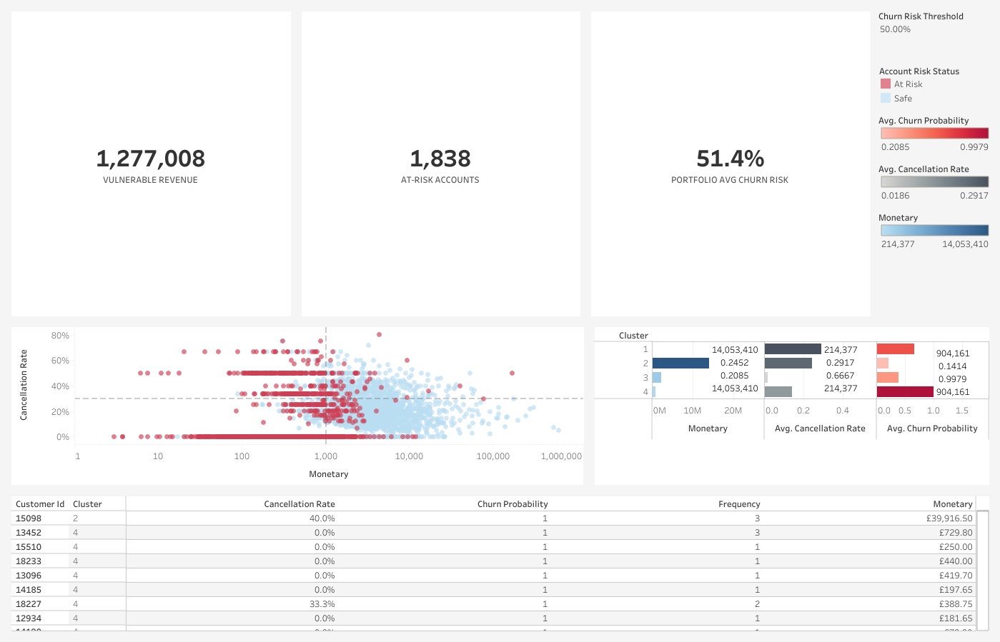

# Retail Retention Command Center: End-to-End Predictive Churn & RFM Clustering Pipeline

[](https://public.tableau.com/app/profile/arnav.dhablania/viz/shared/3R3R6MNN8)
[](./retail_churn_rfm_pipeline.ipynb)

An enterprise-grade data science pipeline that transforms millions of raw retail transaction records into an actionable customer retention platform. Built entirely in **R** for extensive statistical feature engineering and predictive machine learning, the results are dynamically deployed to an interactive **Tableau Executive Retention Dashboard**.

## Executive Retention Dashboard

**[Click Here to Interact with the Live Tableau Dashboard](https://public.tableau.com/app/profile/arnav.dhablania/viz/shared/3R3R6MNN8)**



## Business Problem & Core Objectives

Customer acquisition costs inherently outweigh customer retention expenses in corporate retail. This project analyzes two years of international transaction data from the **Online Retail II dataset (UCI Machine Learning Repository)** to answer two business-critical questions:
1. **Algorithmic Customer Segmentation:** Who are our core customer cohorts based on behavioral footprints, and how do they interact with our ecosystem?
2. **Predictive Churn Modeling:** Which accounts are at imminent risk of leaving, and what is the exact dollar amount exposed to risk?

Instead of relying on isolated or static statistics, this platform lets managers stress-test financial exposure in real time against changing corporate marketing budgets.

## Tech Stack & Pipeline Architecture

* **Data Wrangling & Missing Data Imputation:** `R` (`tidyverse`, `lubridate`, `janitor`, `mice`)
* **Machine Learning & Statistical Modeling:** `tidymodels`, `cluster`, `factoextra`
* **Data Storage & Transfer Layer:** `writexl` (`master_customer_data.xlsx`)
* **Enterprise Business Intelligence:** `Tableau Public`

## Technical Workflow Breakdown

### 1. Data Cleaning & Integrity Audit
* Used `clean_names()` to standardize raw, irregular schemas.
* Isolated operational and structural cancellations (flagged by "C" line items) to map realistic customer return profiles.
* Filtered systemic operational noise (such as administrative "POST" postage metrics) that skews absolute transaction weights.

### 2. Analytical Feature Engineering (RFM Metrics)
Aggregated transactional line items to compress raw histories into structured customer profiles, engineering features for:
* **Recency:** Number of days elapsed since the client's last checkout window.
* **Frequency:** Total count of distinct invoices registered.
* **Monetary Value:** Total historical net spend across all quarters.
* **Cancellation Rate:** Calculated ratio of canceled orders relative to gross purchase invoices.

### 3. Algorithmic Customer Segmentation (K-Means Clustering)
* Normalized heavily right-skewed metric distributions utilizing log scaling and Z-score transformations.
* Applied the **Elbow Method** using `factoextra` to determine the mathematically optimal cluster break to group behavioral profiles into cohorts.

### 4. Machine Learning Predictive Churn Modeling
* Established a strict ground-truth target: a customer is defined as **Churned (1)** if they show a total absence of transactional activity over a 90-day window.
* Split the processed asset directory into an 80/20 train/test structure.
* Trained a binary **Logistic Regression (`glm`)** model to calculate risk as a raw decimal probability string `(0.0 to 1.0)`.
* ***Anti-Leakage Guard:* Explicitly excluded the `recency` attribute from the model formula.** Since recency directly scales with the inactivity target variable, leaving it in would cause data leakage. Removing it ensures a valid, highly generalized predictive model.
* **Performance Validation:** Achieved a highly accurate **86% ROC-AUC score** on unseen test data.

### 5. Deployment & Asset Export
* Applied the validated machine learning pipeline across the entire client ledger to compute and append a personalized `churn_probability` marker to every customer ID.
* Exported the unified dataset into `master_customer_data.xlsx` for immediate execution in Tableau.

## Executive Insights & Strategic Takeaways

* **The Spend Myth Debunked:** High absolute lifetime spend is an unreliable predictor of client retention. Statistical variable auditing proved that historical net spend crosses the null significance threshold. 
* **True Retention Indicators:** A customer's true loyalty index is driven by their purchase **Frequency** (the consistency of their baseline engagement) and their **Cancellation Rate** (the frequency with which they reject shipments).
* **Dynamic Risk Profiling:** By implementing an interactive risk threshold slider within Tableau, corporate leaders can adjust parameters depending on shifting budgetary windows:
  * **Conservative Risk Setting (0.50 Threshold):** Flags 1,838 mission-critical customer accounts, showing an exposed cash runway of **$1.28M**.
  * **Proactive Protection Setting (0.30 Threshold):** Expands the safety net to encompass 4,333 active profiles, establishing an early intervention protocol covering **$3.93M** in potential revenue losses.

## Repository Organization

```box
├── churn_rfm_pipeline.ipynb             # Comprehensive R analytics & ML pipeline script
├── retail_dataset.csv                   # Dataset from Online Retail II UCI
├── master_customer_data.xlsx            # Compiled production dataset consumed by Tableau
├── tableau_preview.png                  # Executive dashboard preview screenshot
└── README.md                            # Repository documentation
